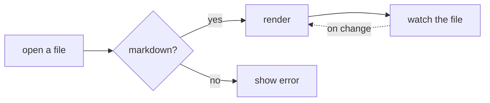

# welcome to upmark

You're reading this inside upmark itself. This document is also the tour — every paragraph below demonstrates a feature, and the page renders all of them at once. If something on this page looks nice and you want to know what makes it tick, the answer is probably in this list.

You can re-open this any time from the command palette (`Ctrl K` → "show welcome"). When you're done, close it with `Ctrl W`.

## The basics

upmark is a markdown reader. You open `.md` files; it renders them in a quiet, typographic frame and remembers where you left off. There's a sidebar on the left with **contents**, **folder tree**, and **recent files**. A top bar on the right with **palette**, **open folder**, **settings**, and the standard window controls. That's the whole UI.

Two paragraphs in and you've already seen the type stack: **Newsreader** for the body (a wide-aspect serif designed by Production Type for long reading), **IBM Plex Sans** for chrome and labels, **JetBrains Mono** for `inline code`. You can swap that stack — see *Themes* below.

## Reading polish

Hover the headings on this page. A `#` icon appears in the gutter — click it to copy a heading link. Hover any code block:

```go
package main

import "fmt"

func main() {
    fmt.Println("hello, upmark")
}
```

A copy button appears in the top-right corner. The block above is rendered with Chroma syntax highlighting (the colors track your theme's light/dark setting).

The reading column is set to a comfortable 68 characters by default. Cycle through `narrow` / `normal` / `wide` with `Ctrl Shift [` and `Ctrl Shift ]`. Bump the font size with `Ctrl +` and `Ctrl -`. Both choices are remembered.

Per-file scroll position is also remembered: close this document, open another, come back here, and you'll be exactly where you were.

### Task lists are interactive

Even in regular markdown files. Click these checkboxes — they actually toggle.

- [x] open a file
- [x] press `Ctrl K` to find the command palette
- [ ] swap to the *terminal* theme just to see what happens
- [ ] then swap back

(For local files we don't persist the checked state. Task lists in **MCP-presented** documents do persist — see the MCP section below.)

### Callouts

> [!NOTE]
> upmark renders the five GitHub callout types — `NOTE`, `TIP`, `IMPORTANT`, `WARNING`, `CAUTION` — in an editorial style with a small-caps label and a colored left rule. No big tinted boxes.

> [!TIP]
> Press `Ctrl K` and start typing. The palette fuzzy-matches against every command, every heading in the current document, every file in the open folder, and every recent file. It's the fastest way to get anywhere.

> [!IMPORTANT]
> The autosave window is 800ms idle, and there's a 200ms-debounced live preview while you type. If you're editing and something feels missing — wait a beat.

### Footnotes

Hover the reference markers to read footnotes inline without scrolling: a claim that needs a citation[^1], another that's longer[^longnote], and a third just to prove it works on more than one[^third].

[^1]: A short footnote. Pop-overs are positioned to stay on-screen.
[^longnote]: A longer footnote with **formatting**, `inline code`, and a [link](https://upmark.dev). It still fits in the tooltip.
[^third]: A third footnote so you can see what multiple refs feel like in a sentence.

### Tables

| Shortcut          | Action                                |
| ----------------- | ------------------------------------- |
| `Ctrl O`          | open file                             |
| `Ctrl Shift O`    | open folder                           |
| `Ctrl L`          | open from URL                         |
| `Ctrl E`          | toggle editor mode                    |
| `Ctrl S`          | save (when editing)                   |
| `Ctrl F`          | find in document                      |
| `Ctrl K`          | command palette                       |
| `Ctrl ,`          | settings                              |
| `Ctrl B`          | toggle sidebar                        |
| `Ctrl Shift [ / ]`| narrower / wider reading column       |
| `Ctrl + / -`      | larger / smaller font                 |

### Math

Inline math: $E = mc^2$. A Greek phrase: $\alpha + \beta = \gamma$.

Display math:

$$
\int_0^\infty e^{-x^2}\,dx = \frac{\sqrt{\pi}}{2}
$$

KaTeX handles the rendering. It supports most of what you'd want from LaTeX math mode.

### Mermaid diagrams



Diagrams pick up the theme's light/dark resolution. Swap themes — the diagram re-renders to match.

## Themes

There are thirteen themes. Open the settings pane (`Ctrl ,` → Appearance) for the grid with live previews, or type "theme" into the palette and pick from the list. Each is a single CSS-variable block keyed off `[data-theme=...]` on the root `<html>` — no per-theme stylesheet, no JavaScript, no FOUC.

A non-exhaustive flavor map:

- **editorial** — warm paper, rust accents, Newsreader body. The default. Auto-tracks your OS light/dark preference.
- **broadsheet** — all-serif, like a newspaper feature page
- **terminal** — mono, dark, amber-on-black
- **manuscript** — parchment, drop caps, sepia
- **arcade** — neon synthwave with scan lines and glow
- **gameboy** — 4-color pixel green, dot-matrix font
- **vapor** — purple-pink gradient, handwriting headlines
- **midnight** — navy library with a gold accent
- ...and **broadsheet**, **newsprint**, **brutalist**, **pastoral**, **architect**, **typewriter**

Try them. The flex themes (arcade, vapor, gameboy) lean hard into their aesthetic — they're meant to make the act of reading feel like a different room.

## Editor mode

Press `Ctrl E` to split the window into a CodeMirror 6 editor on the left and a live preview on the right. The preview updates 200ms after you stop typing. `Ctrl S` saves immediately; otherwise an autosave fires 800ms after you stop typing. The save indicator in the top bar quietly tells you which state you're in.

Edit mode is for short edits in flight — a typo fix while you're reading, a quick line added. For a sustained writing session you're probably better off in your real editor with upmark open alongside.

## File handling

- **Drag-and-drop** any `.md` file anywhere in the window.
- **CLI argument** — `upmark file.md` opens directly.
- **File associations** (Windows, when installed via the NSIS installer) — `.md`, `.markdown`, `.mdown`, `.mkd` all open in upmark.
- **Single-instance lock** — opening a second file when upmark is already running forwards the path to the existing window instead of spawning a new one.
- **External file changes** — fsnotify watches your open file; if another tool writes it (a sync client, your editor) upmark re-renders in place. Your scroll position survives.

## Open from URL

Press `Ctrl L` and paste a markdown URL. Two niceties:

1. `github.com/<user>/<repo>/blob/<branch>/<path>` URLs are auto-canonicalized to `raw.githubusercontent.com` so they actually return markdown and not the GitHub HTML wrapper.
2. Relative images inside the fetched markdown resolve against the source URL — so a doc that uses `` works.

There's a 30-second timeout and an 8MB body cap. Errors surface inline.

## Front-matter

The block of YAML at the very top of this document is the front-matter. upmark parses both YAML (`---...---`) and TOML (`+++...+++`) and renders them as a small editorial byline above the body.

There's a deliberate dedup: if your front-matter `title` matches the first H1 in the document, the byline drops the title and tucks the other metadata under the heading as a standfirst. That's what's happening at the top of this very page — the front-matter says `title: welcome to upmark` and the body starts with `# welcome to upmark`, so you don't see "welcome to upmark" rendered twice.

## MCP server

upmark can run a local **Model Context Protocol** server on `127.0.0.1:11451`. Off by default. Turn it on in Settings → MCP server.

When it's running, any MCP client that supports a localhost SSE endpoint — Cursor, VS Code, Cline, Continue, Zed, Windsurf, Warp, Codex, Gemini CLI, or the [test client](https://github.com/captured-ventures/upmark/tree/main/cmd/mcp-test) shipped in this repo — can:

- `present_document` — push a markdown document into your reader window
- `update_document` — replace its content (task-list checkbox state is preserved across updates, matched by line text)
- `get_document_status` — read back which task-list items you've checked
- `list_presented` — list all open MCP documents
- `close_document` — close one

The use-case is using upmark as the *reading surface* for an agent. The model writes a design review, a plan, a status update; you read it in good typography, check off the items you're approving; the model polls to see what stuck.

A note on the Claude family: Claude Desktop, Claude Code, and Claude.ai don't currently support localhost SSE MCP servers — only stdio or remote. A `.mcpb` bundle that bridges the two is in the works; until it ships, Claude can't talk to upmark directly. Every other MCP client listed above works today.

It's localhost-only with no auth. Don't expose the port.

## Command palette

Everything's in the palette. `Ctrl K`. Type anything — action names, heading text, filenames from your open folder, recent files, theme names, theme blurbs. It's fuzzy-matched, ranked, and grouped.

If you only learn one shortcut, learn this one.

## Smart typography

upmark runs the goldmark Typographer extension, so straight quotes become "curly quotes" and triple-hyphens become em-dashes — like that — without you doing anything. Autolinks are also free: paste a URL like https://wails.io into your markdown and it'll link. Same for email addresses, like hello@example.com.

## A note on the philosophy

upmark is intentionally small. There is no plugin system. There is no syncing. There is no AI sidebar. (The MCP server is the inverse of that — *you* are the human in the loop, the model is the assistant on the side.) It is one window, one document, one job. The job is reading markdown well.

If you want it to do more, [open an issue](https://github.com/captured-ventures/upmark/issues). If you want to make it do more, [send a pull request](https://github.com/captured-ventures/upmark/blob/main/CONTRIBUTING.md). If it does what you need and you'd like to know what's next, watch the repo or check the changelog.

---

That's the tour. Close this with `Ctrl W` and start reading something real.
