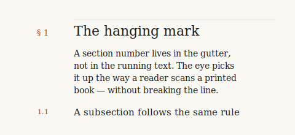
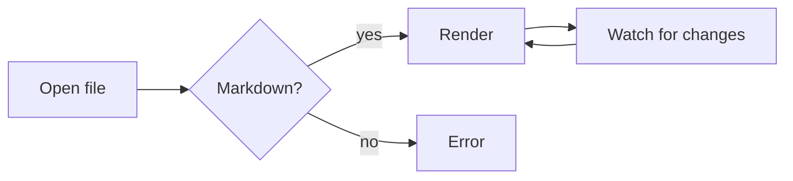

# upmark sample document

This file exercises every renderer and reader feature so you can spot regressions at a glance. Hover any heading to reveal a `#` icon — click it to copy a markdown link. Hover a code block to reveal a copy button in the corner. Hover the `[^1]` references to see footnote tooltips. Click any image to open a lightbox. Press `⌘` (top right) to open the command palette, or `Ctrl+K`.

## Basics

Paragraphs, **bold**, *italics*, ~~strikethrough~~, `inline code`, and [a link](https://example.com).

Smart quotes — "like this" — and em-dashes come from the Typographer extension.

An autolinked URL: https://wails.io and an autolinked email: hello@example.com.

## Wikilinks & navigation

Wikilinks resolve to sibling markdown files by basename: jump to [[notes]] and use Alt-← to come back.

If you click a sibling-folder relative link like [notes.md](notes.md), it also opens inside upmark.

## Images

Click the figure below to open it in the lightbox. The caption is the markdown alt text.



Local relative paths resolve against the directory of the open file. External http(s) images load the same way; they just route through the network.

## Lists

- bullet one
- bullet two with `code`
  - nested bullet
  - another nested
- bullet three

1. ordered
2. ordered
3. ordered

### Task list

- [x] open file
- [x] render markdown
- [x] copy a heading link
- [ ] add an editor pane

## Quotes & callouts

> A regular blockquote.
> Spanning two lines.

> [!NOTE]
> This is a note callout. Editorial style — a small caps label and a left rule, no fill.

> [!TIP]
> Tip callouts use the green left rule.

> [!IMPORTANT]
> Important callouts use the rust accent.

> [!WARNING]
> Warnings show in amber.

> [!CAUTION]
> Cautions show in red.

## Tables

| Feature       | Status | Shortcut       |
| ------------- | ------ | -------------- |
| Open file     | works  | `Ctrl+O`       |
| Open folder   | works  | `Ctrl+Shift+O` |
| Find          | works  | `Ctrl+F`       |
| Command palette | works | `Ctrl+K`     |
| Narrower / wider | works | `Ctrl+Shift+[ / ]` |
| Smaller / larger font | works | `Ctrl+- / +` |

## Code

Hover the blocks below to reveal copy buttons in the top-right corner.

```go
package main

import "fmt"

func main() {
    fmt.Println("hello, upmark")
}
```

```js
const greet = (name) => `hello, ${name}`
console.log(greet('upmark'))
```

## Math

Inline math: $E = mc^2$ and a Greek $\alpha + \beta = \gamma$.

Display math:

$$
\int_0^\infty e^{-x^2}\,dx = \frac{\sqrt{\pi}}{2}
$$

## Mermaid



## Footnotes

Hover any of these to read the footnote inline without scrolling: a claim that needs a citation[^1], another[^longnote], and one more for good measure[^third].

[^1]: A short footnote.
[^longnote]: A longer footnote with **formatting** and a `code` reference.
[^third]: A third footnote so you can see the tooltip on multiple refs.

## Horizontal rule

---

That's the end. Try `Ctrl+Shift+]` to widen the reading column, or `Ctrl+0` to reset font size.
